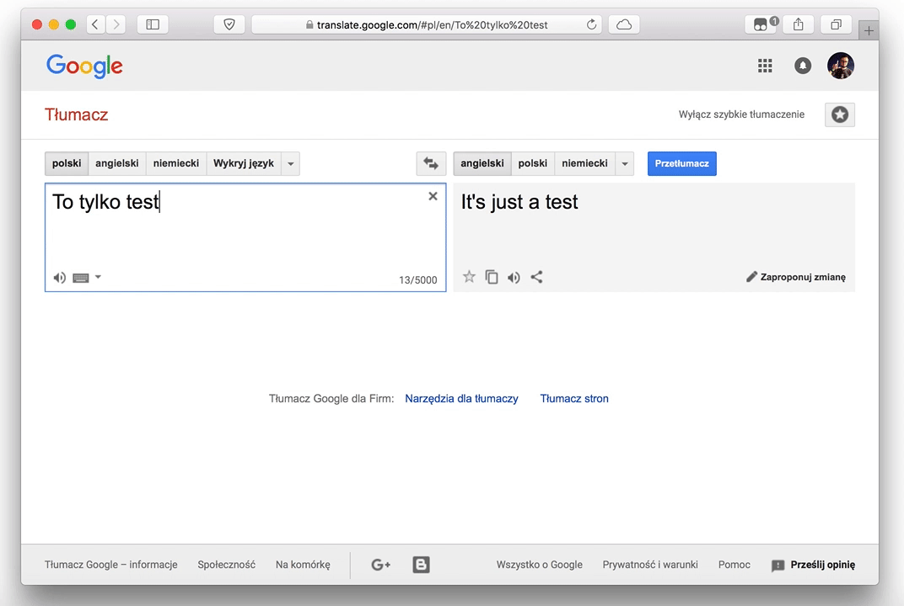

# Google Translate Keyboard Shortcut

A userscript to quick swapping active languages in Google Translate with a keyboard shortcut (<kbd>Ctrl</kbd>+<kbd>S</kbd>).

## Getting Started

### Prerequisites

Make sure you have user scripts plugin installed in your browser. Here are the most popular:

* [Greasemonkey](http://www.greasespot.net/) – Firefox
* [Tampermonkey](https://tampermonkey.net/) – Chrome, Microsoft Edge, Safari, Opera, Firefox
  
### Installing

You can install script:

* directly from GitHub by clicking [here][script-github],
* from [GreasyFork page][script-greasyfork],
* or from [OpenUserJS page][script-openuserjs].
  
### Usage

Press <kbd>Ctrl</kbd>+<kbd>S</kbd> at Google Translate page to swap active languages.

## Contribute

Contributions are very welcome!

[Open an issue][issues-new] for bug and feature requests or [submit PR][pull-request] and make this plugin better.

## Contributor Code of Conduct

Please note that this project is released with a [Contributor Code of
Conduct](http://contributor-covenant.org/). By participating in this project
you agree to abide by its terms. 

## License

This project is licensed under the terms of the [MIT license](./LICENSE).

[issues-new]: https://github.com/Greenek/google-translate-keyboard-shortcut-userscript/issues/new
[pull-request]: https://github.com/Greenek/google-translate-keyboard-shortcut-userscript/compare
[script-github]: https://github.com/Greenek/google-translate-keyboard-shortcut-userscript/raw/master/Google_Translate_Keyboard_Shortcut.user.js
[script-greasyfork]: https://greasyfork.org/en/scripts/21928-google-translate-keyboard-shortcut
[script-openuserjs]: https://openuserjs.org/scripts/greenek/Google_Translate_Keyboard_Shortcut